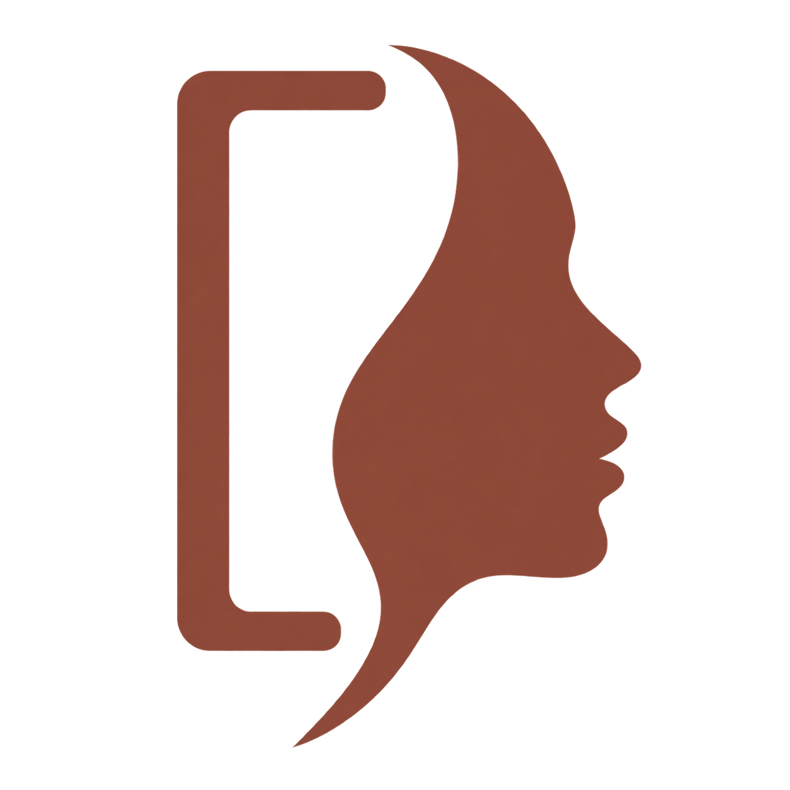

<h1 align="center">&nbsp;  <a href="https://xiaofengshi.github.io/ai-avatar-skill/"></a></h1>

Give one photo and its purpose — let AI act as designer and photographer for your portrait.

[ Codex skill](#codex) · [ ChatGPT prompt](#chatgpt) · [Cases](https://xiaofengshi.github.io/ai-avatar-skill/showcase.en.html) · [Validation log](VALIDATION.en.md) · [Issues](https://github.com/xiaofengShi/ai-avatar-skill/issues) · [中文文档](README.zh-CN.md)

## What it does

| Capability | How it works |
| --- | --- |
| Purpose-driven design | Provide a photo and where it will be used. If the purpose is unclear, the assistant asks first, then designs pose, composition, styling, lighting, and palette. The source photo's head angle is a reference, not a required output angle. |
| Style & local edits | Semi-realistic illustration by default; request other art styles, keep glasses, or adjust expressions — and keep iterating on a version you approve. |
| Avatar crop check | Preview circular crops at 40, 64, 128, and 256 px, on both light and dark backgrounds. |
| Two entry points | Codex runs the skill; ChatGPT uses a two-stage prompt (plan, then generate). |

**Requirement:** your environment must have image generation capability. This project provides the workflow and tools — not a model or generation quota. Examples, before/after comparisons, and crop previews live on the [project homepage](https://xiaofengshi.github.io/ai-avatar-skill/); this README covers installation and usage.

<a id="chatgpt"></a>

## ChatGPT: copy and start

1. Open the [English ChatGPT prompt](prompts/chatgpt.en.md) and copy the planning-stage code block. The [Chinese prompt](prompts/chatgpt.md) remains available.
2. Paste it into a ChatGPT conversation with image generation, attach a photo and its purpose — for example: "For GitHub and Hugging Face, keep my glasses, design everything else yourself."
3. To stay close to the example art style, also attach the [style reference](skills/editorial-avatar/references/style-anchor.png) and note clearly that it only defines the art style. Attaching just the person's photo works too, but describing the style in words may produce larger variation.
4. After reviewing the plan, send the generation-stage block to get the image. Then iterate on a result you approve — for example: "Keep this composition and outfit, only remove the glasses."

The ChatGPT entry splits plan and generate into two messages so image requests do not skip purpose clarification. Without a stated purpose, the assistant is expected to ask first, then design. The Codex entry runs design and generation continuously once the purpose is clear. ChatGPT cannot read photos from local file paths — attach them in the conversation. Image generation, upload, and editing are provided by your account and current interface; this project does not provide generation quota. See the [official image usage guide](https://help.openai.com/en/articles/11084440).

One logged-in Chrome trial of the English wording used the public fictional source photo: ChatGPT asked for the missing purpose, planned after the purpose and photo were supplied, and generated an image after the second instruction. The image remained largely photographic. The [validation log](VALIDATION.en.md) records the observations separately from earlier Chinese-prompt tests.

<a id="codex"></a>

## Codex: activate the skill

Once installed, pick `editorial-avatar` in the Codex input box, attach a photo, and state the purpose — or send directly:

```text
$editorial-avatar This photo is for my GitHub and Hugging Face avatar. Keep my glasses; design everything else yourself.
```

After activation, Codex reads the skill and completes purpose clarification, portrait design, image generation, and avatar preview. Daily use needs only a photo and your requirements — no manual Python runs or file copying.

**First use, not yet installed:** call the installer skill in Codex first:

```text
$skill-installer Install the skill at https://github.com/xiaofengShi/ai-avatar-skill/tree/main/skills/editorial-avatar
```

After installation, pick or type `$editorial-avatar` in the next conversation; already-installed users can activate directly. Installing and invoking are two steps — the repository link itself does not register the skill automatically.

This skill requires image generation capability in the current Codex environment. Without it, the assistant explains the limitation and provides a creative brief. See the [Codex skills documentation](https://learn.chatgpt.com/docs/build-skills) for invocation details.

## Check small sizes and circular crops

The Codex skill calls the bundled preview tool. You can also ask in conversation: "Check this avatar at small sizes and circular crops, and show me a preview."

[See crop examples on the showcase page](https://xiaofengshi.github.io/ai-avatar-skill/showcase.en.html#preview) · [Open a real preview](https://xiaofengshi.github.io/ai-avatar-skill/examples/developer/preview.html)

Open the generated HTML in a browser at 100% zoom. It includes circular crops at 40, 64, 128, and 256 CSS px, light and dark backgrounds, and the full original image; images are embedded for offline sharing. It does not modify the original, upload files, or judge whether the result looks good. The preview embeds the original image data — sharing the preview shares the image. Existing output is refused by default; add `--force` to replace it.

Online preview links in this README are served via GitHub Pages; HTML file pages inside the GitHub repo show source only. For offline viewing, download the repository and open the HTML in a browser.

Example previews in this repo use `--linked` to reference originals by relative path, avoiding duplicate copies of large image data in Git. In this mode, keep the HTML and images in their relative positions when offline; without the flag, a standalone embedded version is generated.

## Maintenance & contributing

The canonical design rules live in the Chinese [workflow.md](skills/editorial-avatar/references/workflow.md), which Codex reads directly. [workflow.en.md](skills/editorial-avatar/references/workflow.en.md) is the maintained English translation. The build script generates both ChatGPT prompts from those sources; do not hand-edit generated files. Review both languages when changing the rules.

The commands below let maintainers verify the toolkit; regular users go through the skill entry points above. The Python tools depend only on the standard library; maintenance checks require Python 3.9+. To debug the avatar preview on its own:

```bash
python3 skills/editorial-avatar/scripts/preview_avatar.py avatar.png --output preview.html
```

```bash
python3 scripts/build_prompt.py
python3 scripts/build_prompt.py --check
python3 -m unittest discover -s tests -v
python3 scripts/check_package.py
```

This README covers features and usage; [SHOWCASE.en.md](SHOWCASE.en.md) and [SHOWCASE.md](SHOWCASE.md) source the English and Chinese case pages, while [VALIDATION.en.md](VALIDATION.en.md) and [VALIDATION.md](VALIDATION.md) source their validation pages. The landing pages `index.html` (English) and `zh.html` (中文) are hand-authored. Gallery templates live in `scripts/showcase.en.html` and `scripts/showcase.html`. HTML is generated with Node 20+ and the dev dependency `marked`; regular use does not require installing them. GitHub Pages publishes the generated HTML from the `main` branch root, with `.nojekyll` preserving original static file paths. After updating docs, regenerate the HTML and commit it together:

```bash
npm ci
npm run build:docs
npm run check:docs
```

When contributing examples, submit the purpose, the division of labor among inputs, the actual prompts, unselected trial results, and known issues; only submit material you have the right to publish. Distinguish tool-generated output, assistant review, and user approval — do not delete failed images and claim stability. Claims of quality improvement should include short-prompt comparisons under the same input, same model, and same retry budget.

So far the project has a small number of fictional-character tests, one real travel-photo case, and basic interaction tests. There is no evidence yet of better image quality than short prompts, or of stable output — see the [validation log](VALIDATION.en.md) for the full boundaries.

## License & assets

Code, prompts, and docs are under the [MIT License](LICENSE). The AI-generated fictional assets bundled with this repo may be used and redistributed with the project; see [asset notes](ASSETS.md) for sources and scope. The travel case is licensed only for display as an example in this repository — neither MIT nor the fictional-asset redistribution terms apply to it. The license also does not cover photos uploaded by users.
