# 从一张照片，到适合你的肖像。

Editorial Avatar / 案例展厅

同一张照片，可以服务不同的用途。这里展示用途如何影响构图、服装、配色，以及一次修改如何改变结果。

## 案例对照

**7 组示例，按用途看设计。** 旅行插画来自用户授权公开的真实照片，成片已获该用户认可；其余 6 组覆盖 3 个 AI 生成的虚构人物。所有成片均由 Codex 内置图像工具生成。每组原图与结果等大展示，点击图片可查看原尺寸。

| 用途与要求 | 输入照片 / 编辑基底 | 生成结果 | 设计、观察与记录 |
| --- | --- | --- | --- |
| **旅行氛围插画** 生活照 → 环境肖像 保留侧脸、眼镜与旅行感 | [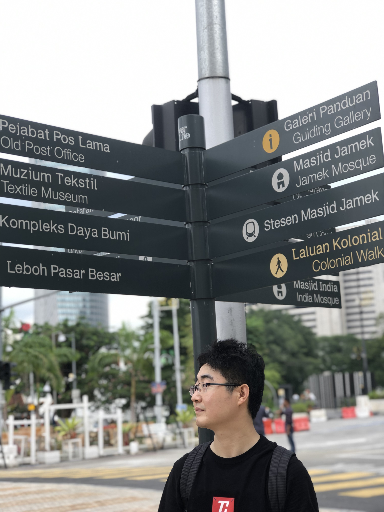](examples/travel/source.png) | [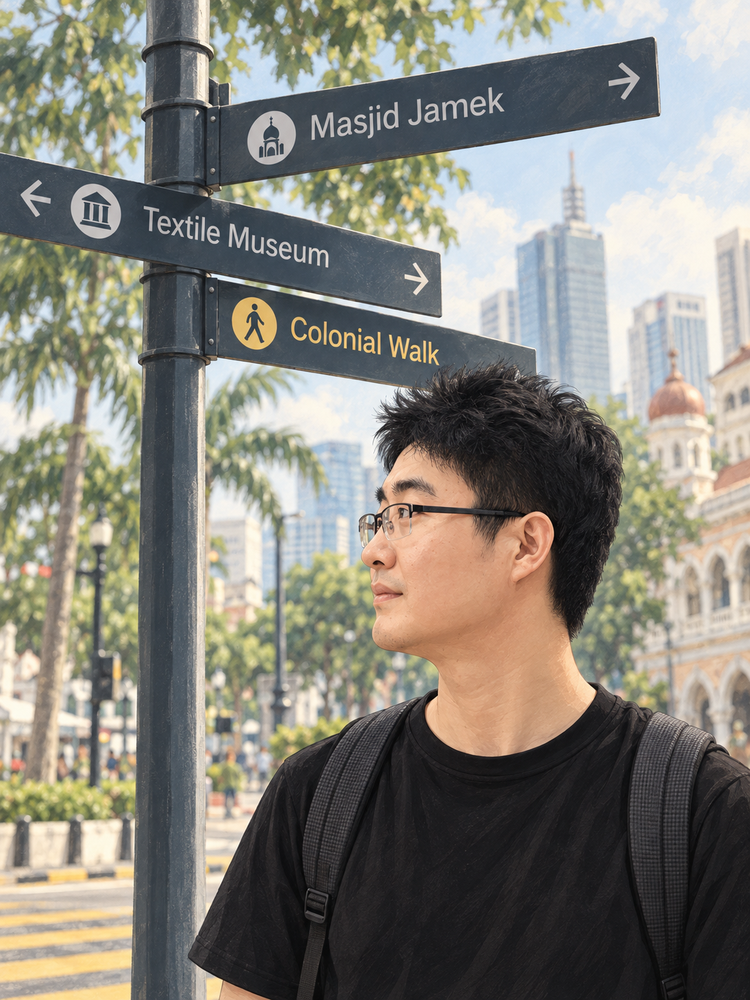](examples/travel/illustration.png) | **用户已认可并授权公开。** 拉近人物，以路牌、绿荫与柔和日光交代旅行场景。街景经过重构，不是现场复原。 [请求](examples/travel/request.txt) · [实际指令](examples/travel/generation.prompt.txt) |
| **海马体风格证件照演示** 中国女性 · 简历／员工资料 普通照片 → 精致影棚照 | [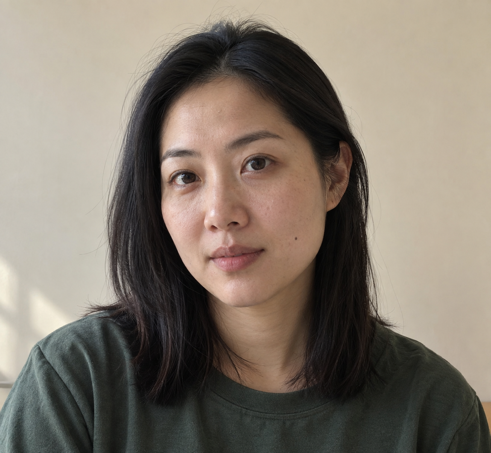](examples/studio-id-photo/source.png) | [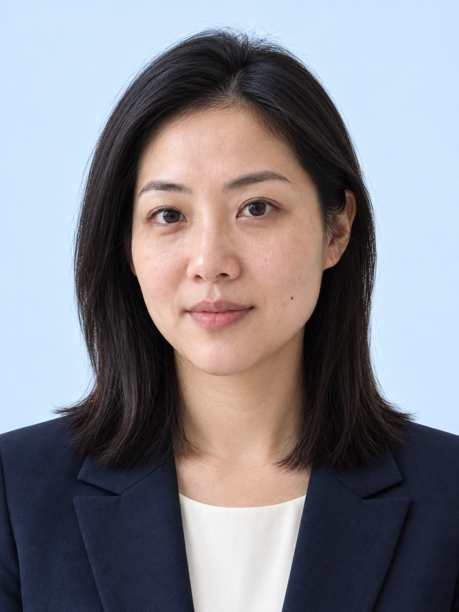](examples/studio-id-photo/portrait.png) | 正面头肩构图、浅蓝背景、深蓝西装与克制妆容；发型和左颊痣可对照，面部细节仍有生成变化。**仅为 AI 案例，非海马体出品，也未验证正式证件规格。** [请求](examples/studio-id-photo/request.txt) · [源图指令](examples/studio-id-photo/source.prompt.txt) · [成片指令](examples/studio-id-photo/generation.prompt.txt) |
| **GitHub / Hugging Face** 自然、容易接近 保留眼镜 | [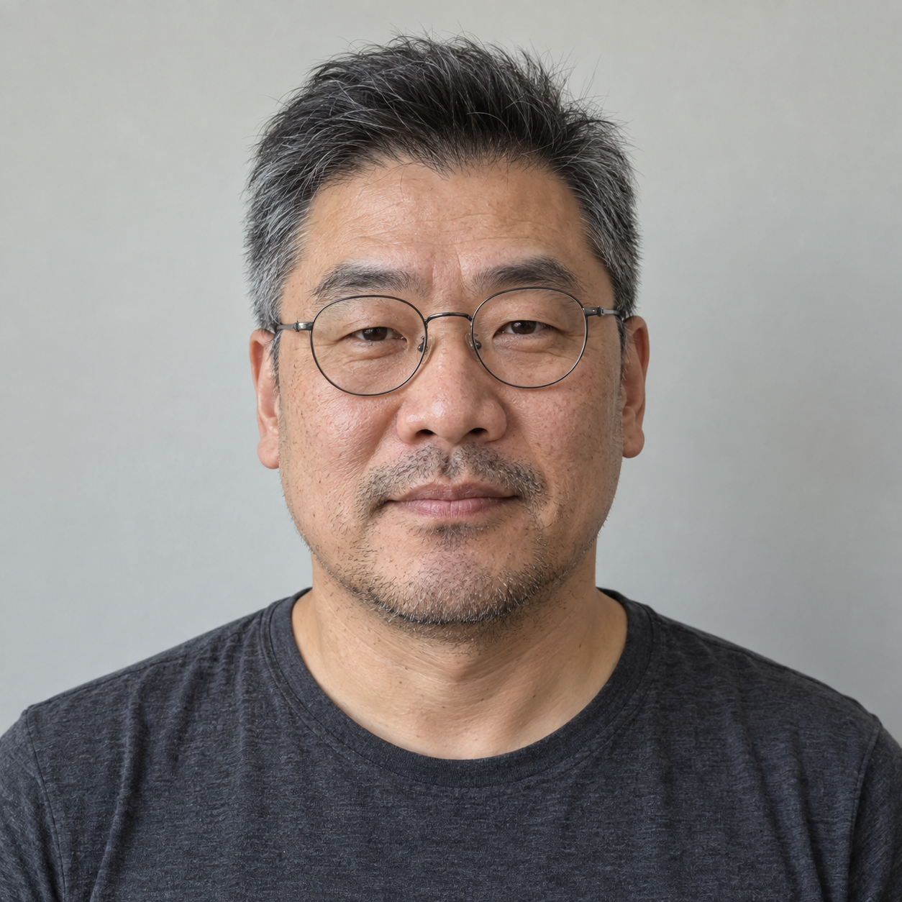](examples/developer/source.png) | [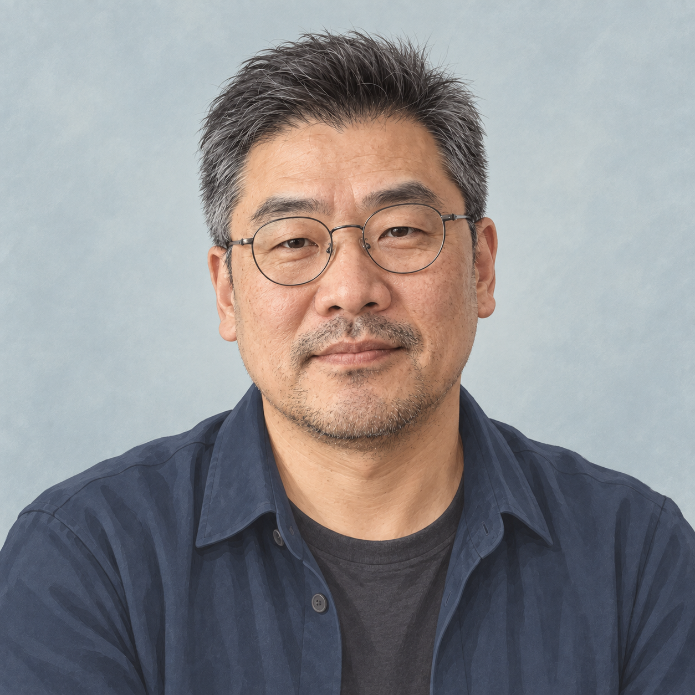](examples/developer/avatar.png) | 墨蓝便装配浅蓝灰背景，保留灰白短发与年龄感。皮肤纹理仍偏细密。 [请求](examples/developer/request.txt) · [实际指令](examples/developer/generation.prompt.txt) · [圆裁切预览](https://xiaofengshi.github.io/ai-avatar-skill/examples/developer/preview.html) |
| **大会演讲者介绍** 保留年龄、肤色 与短卷发 | [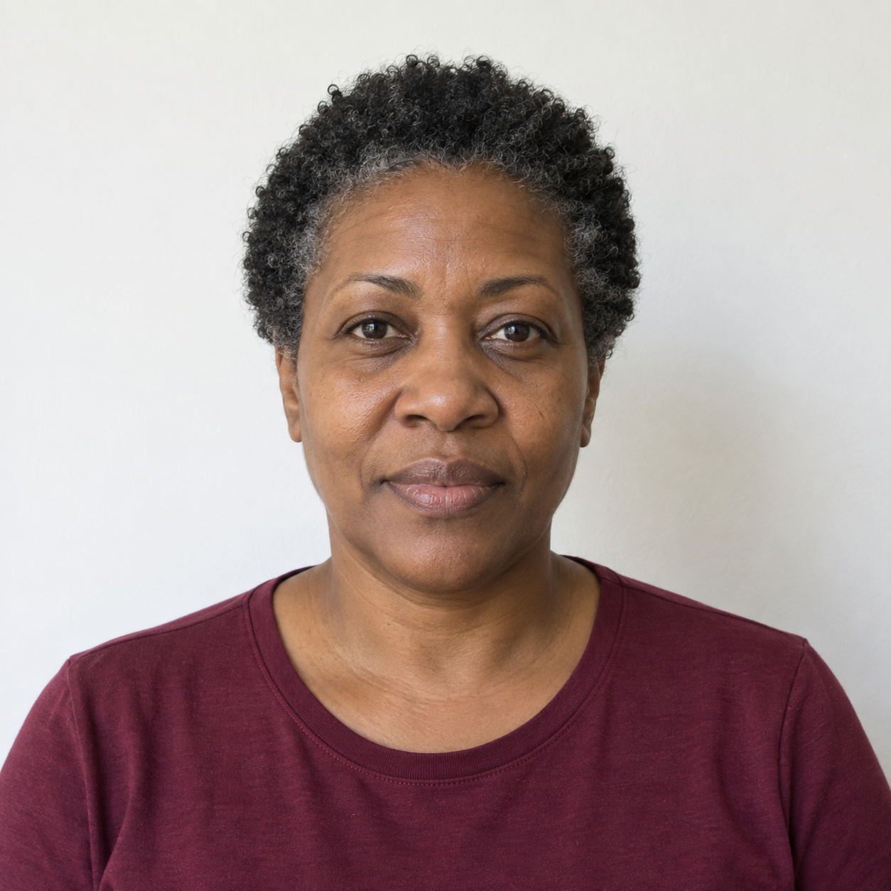](examples/speaker/source.png) | [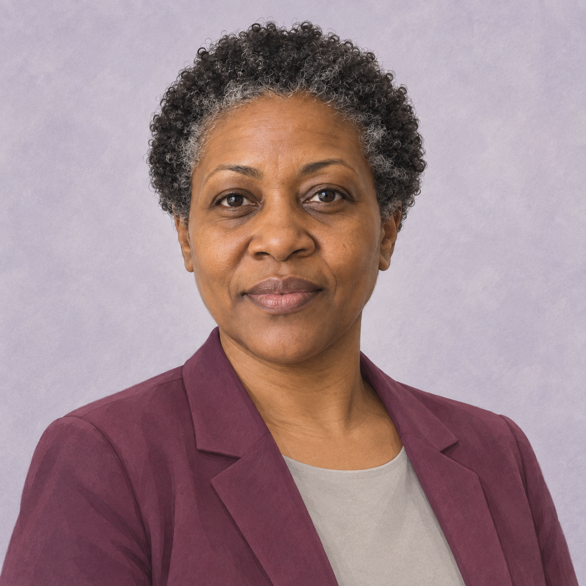](examples/speaker/avatar.png) | 梅紫外套配灰紫背景，神态平静亲和。五官略有重绘。 [请求](examples/speaker/request.txt) · [实际指令](examples/speaker/generation.prompt.txt) · [圆裁切预览](https://xiaofengshi.github.io/ai-avatar-skill/examples/speaker/preview.html) |
| **只去掉眼镜** 保留构图、神态 服装、背景和画风 |  | [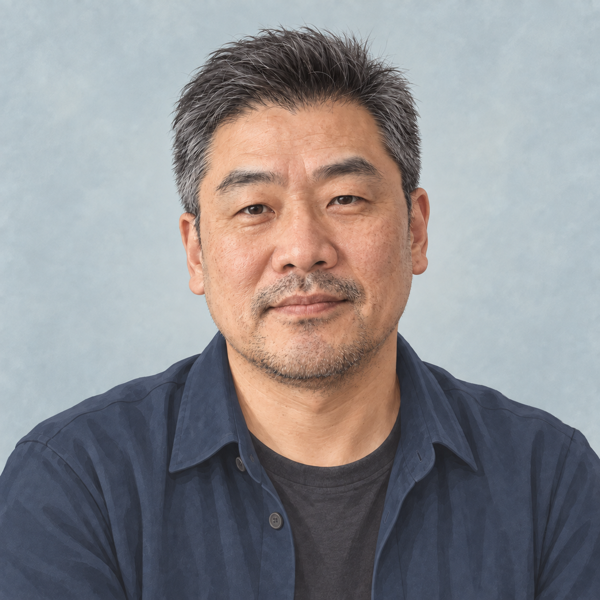](examples/remove-glasses/avatar.png) | 镜框、鼻托与镜腿已去除，整体设计接近原版。眼周存在补绘，不是遮挡细节的真实还原。 [请求](examples/remove-glasses/request.txt) · [实际指令](examples/remove-glasses/generation.prompt.txt) · [圆裁切预览](https://xiaofengshi.github.io/ai-avatar-skill/examples/remove-glasses/preview.html) |
| **深色研究团队主页** 同一人物适配新用途 保留眼镜和年龄感 |  | [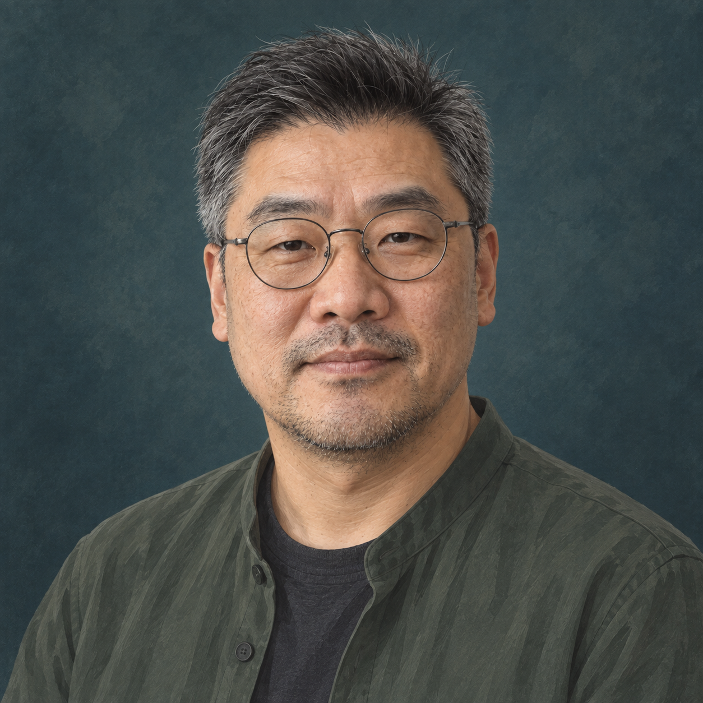](examples/researcher/avatar.png) | 深绿便装、蓝绿背景与柔和侧光。40 px 下肩部对比偏弱，脸部仍可辨；不能据此认为优于社区版。 [请求](examples/researcher/request.txt) · [实际指令](examples/researcher/generation.prompt.txt) · [圆裁切预览](https://xiaofengshi.github.io/ai-avatar-skill/examples/researcher/preview.html) |
| **微笑与姿态修正** 头颈肩整体协调 保留微笑、服装与配色 |  | [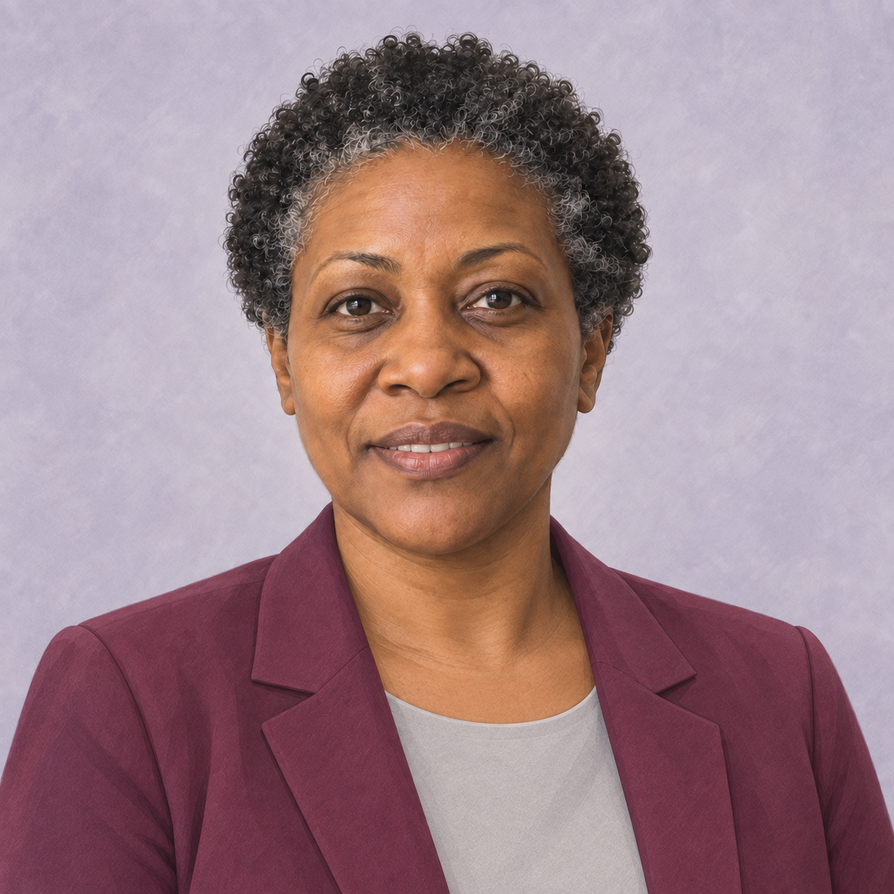](examples/speaker-smile/avatar-v2.png) | 首版被用户指出头身方向不协调；重作一次，减小歪头幅度并调整肩线、领口。**修正版待用户确认。** [首版问题图](examples/speaker-smile/avatar.png) · [反馈](examples/speaker-smile/feedback.txt) · [修正指令](examples/speaker-smile/correction.prompt.txt) · [圆裁切预览](https://xiaofengshi.github.io/ai-avatar-skill/examples/speaker-smile/preview-v2.html) |

示例完成于 2026-09-21 至 2026-09-24。六组虚构人物案例首版均一次生成；其中微笑案例被用户指出姿态问题，已追加一次修正并保留首版记录；旅行照片首次因 JPEG 读取失败未出图，转为 PNG 后用相同简报生成一张成片。旅行版使用了早期对话的画风参考，该参考未获再分发授权、未收入仓库，并非本项目附带的公共风格图。新增证件照风格案例是摄影棚视觉方向演示，未经尺寸、背景或修饰规则的正式证件验收。

这些是助手按 skill 流程设计简报后执行的生成与编辑案例，尚未作独立真人评审或同条件重复测试；一位用户认可一张图不代表稳定性验证。完整输入分工、审片观察与边界见 [验证记录](validation.html) 和 [素材说明](https://github.com/xiaofengShi/ai-avatar-skill/blob/main/ASSETS.md)。

## 小尺寸，也值得认真看

下方直接用虚构人物的高清成片渲染圆形裁切，不放大低分辨率截图。

  
<strong>浅色界面</strong>

    <figure><figcaption>40 px</figcaption></figure>
    <figure><figcaption>64 px</figcaption></figure>
    <figure><figcaption>128 px</figcaption></figure>
    <figure><figcaption>256 px</figcaption></figure>
  

  
<strong>深色界面</strong>

    <figure><figcaption>40 px</figcaption></figure>
    <figure><figcaption>64 px</figcaption></figure>
    <figure><figcaption>128 px</figcaption></figure>
    <figure><figcaption>256 px</figcaption></figure>
  

检查真实 CSS 尺寸时，请[打开完整预览](https://xiaofengshi.github.io/ai-avatar-skill/examples/developer/preview.html)并保持浏览器 100% 缩放。

## 从这里开始

[在 Codex 中激活 skill](https://github.com/xiaofengShi/ai-avatar-skill/blob/main/README.zh-CN.md#codex) · [使用 ChatGPT prompt](https://github.com/xiaofengShi/ai-avatar-skill/blob/main/README.zh-CN.md#chatgpt)

把照片和用途交给助手。安装、功能、使用要求与贡献方式见 [中文使用文档](https://github.com/xiaofengShi/ai-avatar-skill/blob/main/README.zh-CN.md)。
